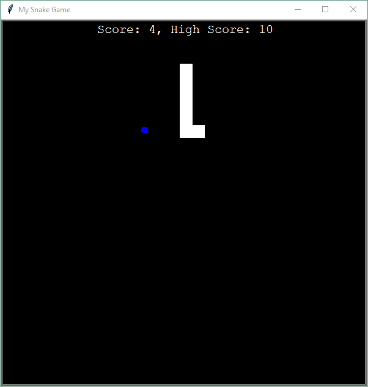

# Snake Game
> It's a repetitive snake game with a highscore table.

## Table of contents
* [General info](#general-info)
* [Screenshots](#screenshots)
* [Technologies](#technologies)
* [Setup](#setup)
* [Status](#status)

## General info
Genral rules are commonly known. However, if you do not know them, I refer you to [this](https://en.wikipedia.org/wiki/Snake_(video_game_genre))
Use arrows to change the direction on the snake. Food is spawning randomly on the map after you eat it.

Main goal of the project was to practice with a turtle library.

## Screenshots
\

## Technologies
* Python 3.8
* Turtle 3.9.5

## Setup
Install missing libraries if necessary.

## Status
Project is: _finished_.
